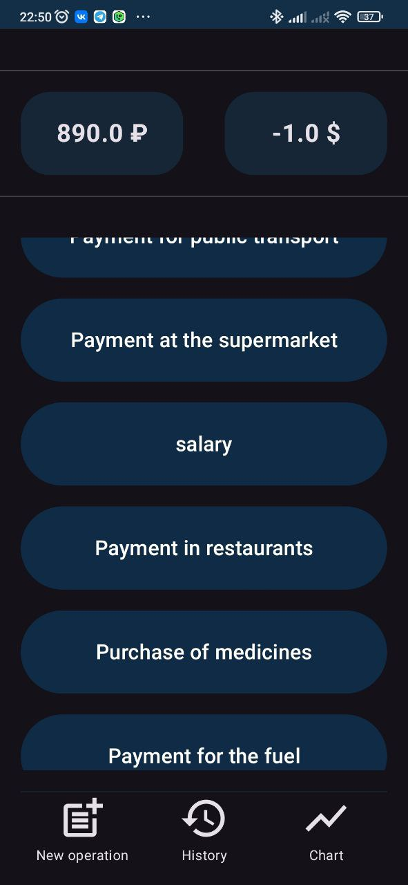
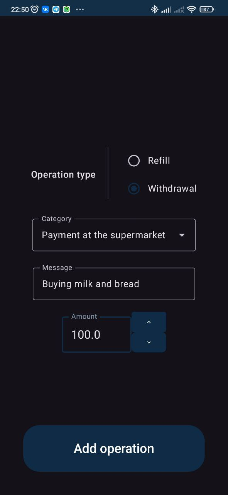
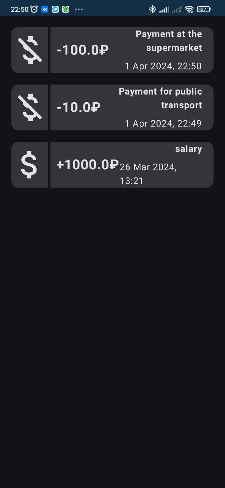
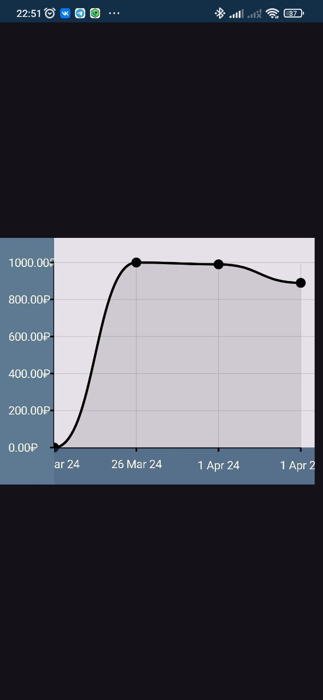

# Description
Android application for financial accounting. 
You will be able to:

1. View you balance at the current moment:
   
2. Add new finance operation for exist or your own category:
   
3. View operations history:
   
4. View your balance changes history:
   

## Libraries
* **Jetpack Compose** -- UI
* **Decompose** -- Routing
* **MVIKotlin** -- Logic
* **Room** -- Database (uses SQLite)
* **Reaktive** -- Used with MVIKotlin